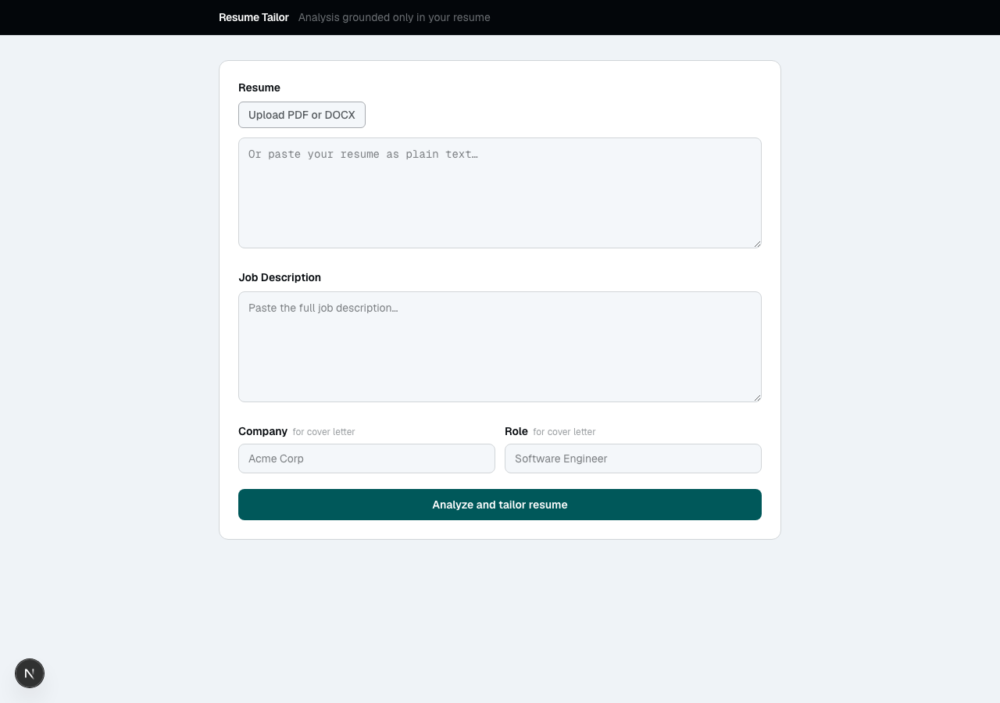
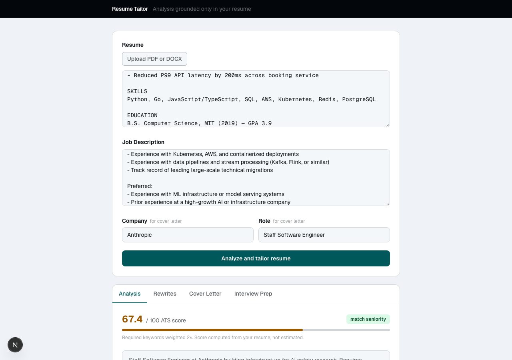
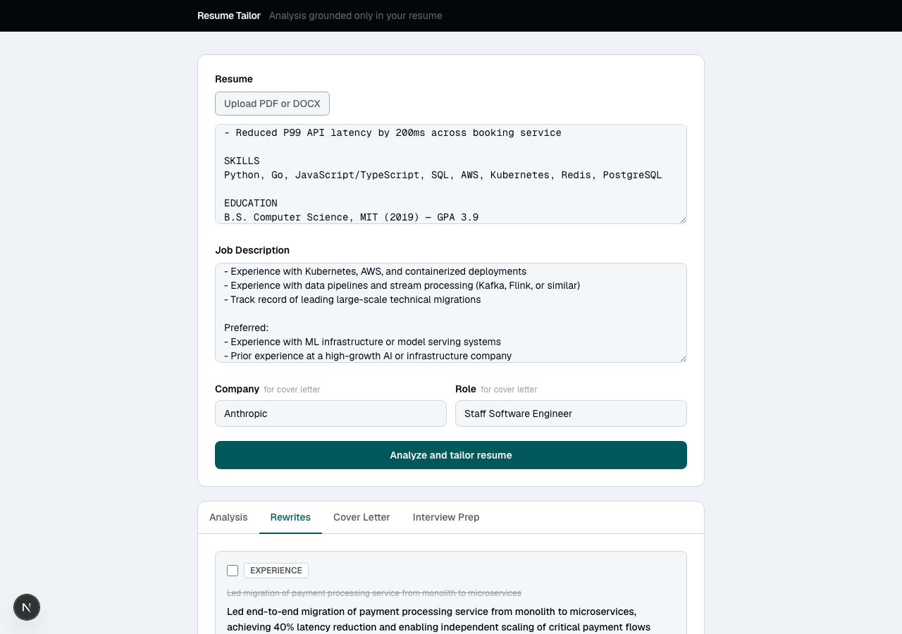
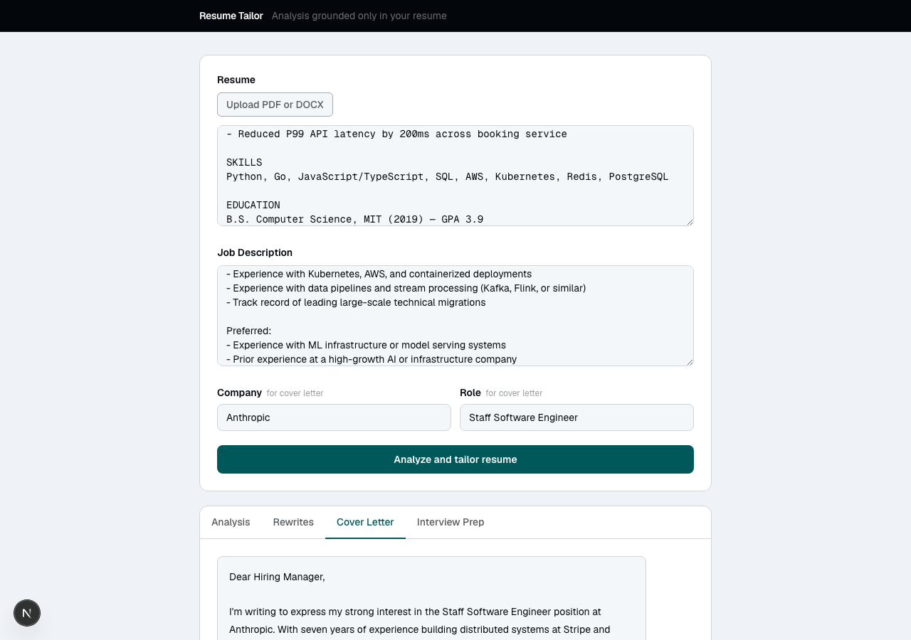
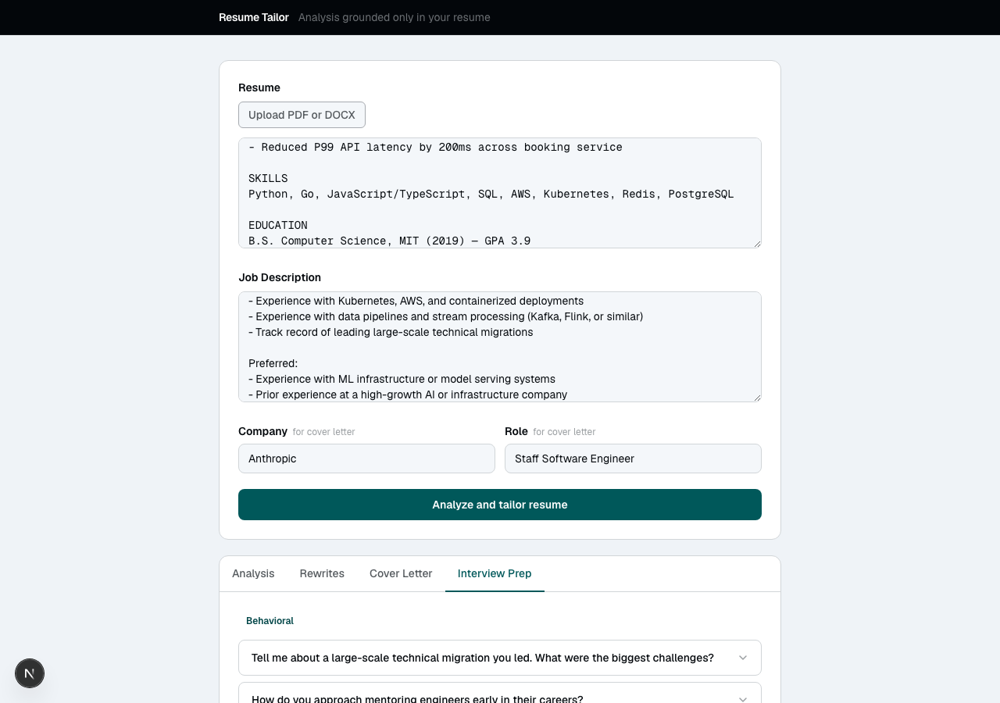
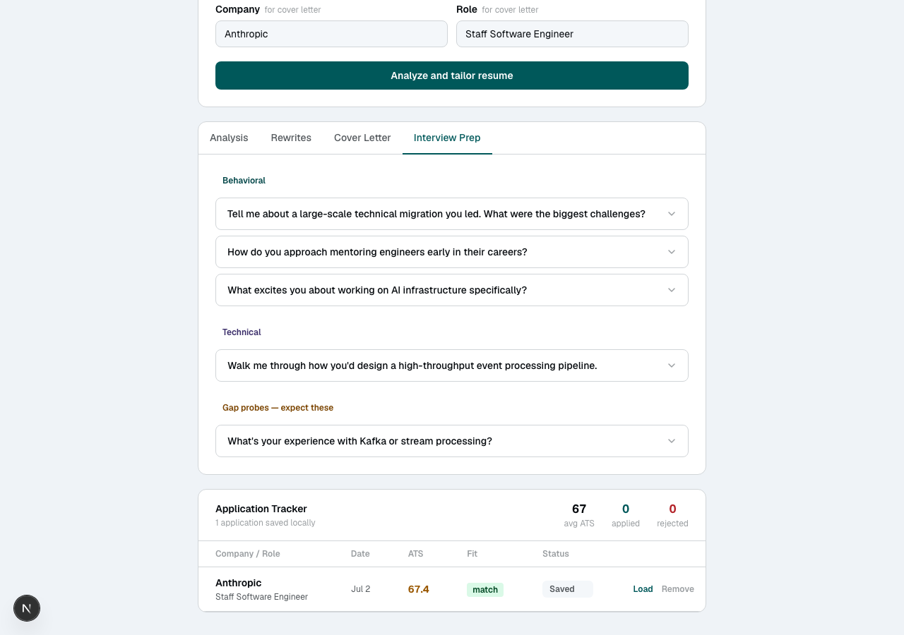

# Resume Tailor

A multi-agent system that analyzes your resume against a job description and produces a gap analysis, targeted rewrite suggestions, a cover letter draft, and interview prep — without fabricating experience you don't have.

**Live:** [resume-tailor.vercel.app](https://resume-tailor.vercel.app)

---

## Screenshots

### Input
Paste resume text or upload a PDF/DOCX. Add a job description plus company and role for cover letter generation.



### ATS Analysis
Computed ATS score (not LLM-estimated), seniority match, matched/missing keyword grid, and skill gap breakdown with adjacency signals.



### Rewrite Suggestions
Line-level diff view — strikethrough original, bolded suggestion, reason, and grounding source. Select suggestions to include in a DOCX export.



### Cover Letter
Full draft grounded in your resume sections, with per-paragraph source attribution and DOCX export.



### Interview Prep
Questions categorized as behavioral, technical, or gap probe (flagged gaps the interviewer is likely to probe). Each question expands with talking points anchored to your resume.



### Application Tracker
Locally-persisted table of every analysis run — ATS score, seniority fit, status (saved / applied / rejected), and a Load button to pull any past run back into the form.



---

## Architecture

```
resume (PDF/DOCX/text) + job description
        │
        ▼
  Analyzer Agent  ──▶  AnalysisResult (matched/missing keywords, ats_score, skill gaps)
        │
        ├──────────────────────────┬────────────────────────────┐
        ▼                          ▼                            ▼
  Rewrite Agent          Cover Letter Agent          Interview Prep Agent
  (line-level diffs)     (grounded draft)            (behavioral/technical/gap_probe)
        │
        ▼
  Grounding Check (deterministic — no LLM)
```

All LLM calls go through `src/llm_client.py` — one file to swap providers (currently Groq llama-3.3-70b-versatile).

## ATS Score formula

```
score = 100 × matched / (matched + missing_required×2 + missing_preferred×1)
```

Computed in code after the LLM extracts keyword lists — not an opaque LLM-generated number.

## Setup (local)

```bash
git clone https://github.com/megradhikan/resume-tailor
cd resume-tailor

# Backend
python3 -m venv .venv && source .venv/bin/activate
pip install -r requirements-dev.txt   # prod deps + pytest
cp .env.example .env
# Add GROQ_API_KEY to .env (free at console.groq.com)

# Run tests
pytest tests/

# Start backend
uvicorn src.api.app:app --reload

# Frontend (new terminal)
cd frontend
cp .env.local.example .env.local
npm install && npm run dev
# → http://localhost:3000
```

### Full-stack with Docker Compose

```bash
cp .env.example .env          # add GROQ_API_KEY
docker compose up --build
# backend → http://localhost:8000
# frontend → http://localhost:3000
```

## CLI (v0, still works)

```bash
source .venv/bin/activate
python3 -m src.cli           # rich output
python3 -m src.cli --json    # raw JSON
```

## Tests

```bash
python3 -m pytest tests/ -v   # 13 unit tests, no LLM calls
```

## Deployment

**Backend → Railway**
1. Connect the repo in Railway
2. Set `GROQ_API_KEY` and `ALLOWED_ORIGINS` env vars
3. Railway picks up `railway.toml` automatically — uses the `Dockerfile`

**Frontend → Vercel**
1. Import the repo, set root directory to `frontend/`
2. Set `NEXT_PUBLIC_API_URL` to your Railway backend URL

## Versions

| Version | Status | Description |
|---------|--------|-------------|
| v0.1.0 | released | CLI, plain text, Analyzer + Rewrite agents |
| v1.0.0 | released | PDF/DOCX upload, all 4 agents, FastAPI + Next.js, Docker |
| v2.0.0 | current | Redesigned UI, application tracker, DOCX export, grounding validation |
| v3 | planned | Eval harness, observability, batch JD processing |
